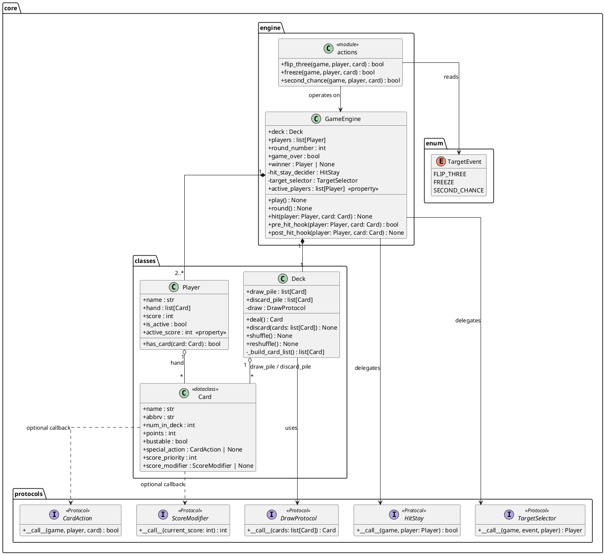
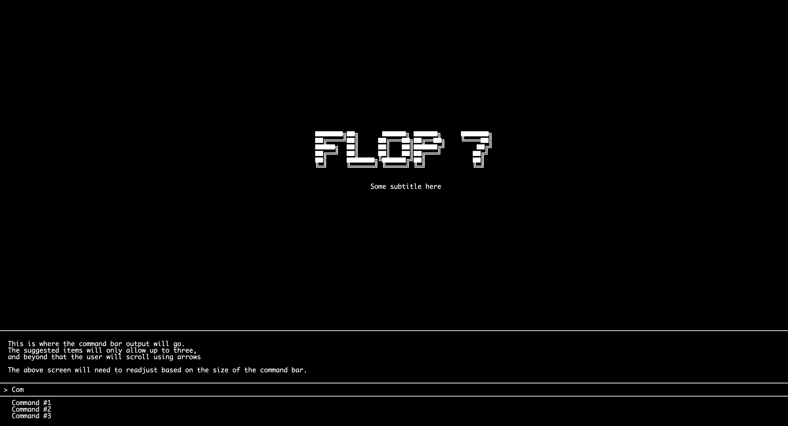
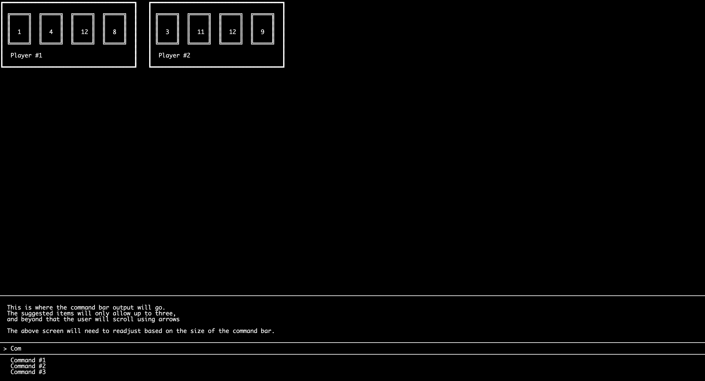
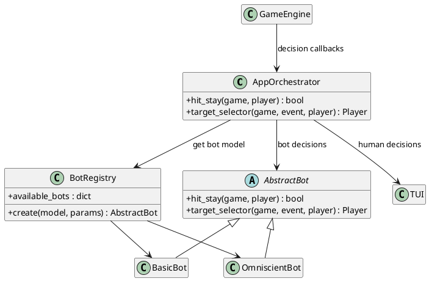

# flop7

The unofficial Flip 7 terminal emulator

> [!NOTE] 
> This document was created with the help of Github Copilot. The architecture itself was created by Ben Halladay, and Copilot assisted in generating diagrams based on code already written by Ben Halladay.

## Overview

flop7 is a terminal based emulator for the popular game Flip 7. It allows the user to track points for a live game, or play the game virtually against others or against bots.

### Flip 7 — Game Summary

Flip 7 is a press-your-luck card game for 3+ players. Players race to be the first to accumulate **200 points** across multiple rounds.

The 94-card deck contains three categories of cards:

| Category | Cards | Bustable |
|---|---|---|
| **Number** (0–12) | 79 cards — each value N appears N times (except 0, which has 1) | Yes |
| **Action** (Flip Three, Freeze, Second Chance) | 9 cards (3 of each) | No |
| **Score Modifier** (+2, +4, +6, +8, +10, ×2) | 6 cards (1 of each) | No |

Each round, players take turns choosing to **hit** (draw a card) or **stay** (bank their points and exit the round). Drawing a duplicate number card causes a **bust** — the player scores 0 for that round. If a player collects 7 unique number cards, the round ends immediately and they receive a 15-point bonus.

Action cards allow you to target other players with special abilities: **Flip Three** forces a target to draw 3 cards, **Freeze** forces a target to bank and exit, and **Second Chance** absorbs one future duplicate.

Score modifier cards adjust end-of-round scoring: ×2 doubles the number card total (applied first), then flat bonuses (+2 through +10) are added on top.

## Core design

### Architecture

The game logic lives in `src/flop7/core/` and is organized into four sub-packages:

```text
core/
├── classes/      # Data objects — Card, Deck, Player
├── engine/       # Game loop and action card resolution
├── enum/         # Enumerations for events and decisions
└── protocols/    # Structural typing contracts (Protocol classes)
```

#### `classes/` — Data Layer

- **`Card`** — A `@dataclass` representing a single card definition. Fields include the card's name, abbreviation, deck count, point value, bustable flag, an optional `special_action` callback, and an optional `score_modifier` callback with an associated `score_priority`. All 22 unique card types are defined as module-level constants in `cards.py` (e.g. `ZERO`, `FLIP_THREE`, `PLUS_TWO`), and collected into `ALL_CARDS` and `CARD_MAP` for lookup.

- **`Deck`** — Manages the draw pile and discard pile. On construction it expands `ALL_CARDS` into the full 94-card list (respecting `num_in_deck`) and shuffles. Drawing is delegated to an injected `DrawProtocol` callable — this allows the same `Deck` class to serve both a virtual game (random pop) and a physical-card mode (external input). `reshuffle()` recycles the discard pile when the draw pile runs low.

- **`Player`** — Pure state container for a single player. Tracks `name`, `hand`, cumulative `score`, and `is_active` status. The computed property `active_score` calculates the current round score by sorting modifiers by `score_priority` (×2 first, then flat bonuses) and folding them over the number-card sum.

#### `engine/` — Game Loop

- **`GameEngine`** — The core engine class that owns the round lifecycle. It holds the `Deck`, player list, and two injected decision callbacks (`HitStay` and `TargetSelector`). The core loop is:
  1. `play()` calls `round()` until a player reaches 200 points.
  2. `round()` iterates active players: each either hits or stays.
  3. `hit()` processes a drawn card — checking for Second Chance absorption in `pre_hit_hook()`, dispatching `special_action` callbacks for action cards, and detecting busts for duplicate number cards.
  4. After the round, every player's `active_score` is added to their cumulative `score`, hands are discarded, and the win condition is checked.

- **`actions`** — Module-level functions (`flip_three`, `freeze`, `second_chance`) that implement the three action card effects. Each follows the `CardAction` protocol signature `(game, player, card) -> bool`. At module load time, these functions are patched onto the corresponding `Card` constants via `FLIP_THREE.special_action = flip_three`, etc.

#### `enum/` — Enumerations

- **`TargetEvent`** — Identifies the reason a target is being selected (Flip Three, Freeze, or Second Chance), so the `TargetSelector` callback can present appropriate context.

#### `protocols/` — Dependency Contracts

All external behavior the engine depends on is expressed as `typing.Protocol` classes, enabling structural (duck) typing:

| Protocol | Signature | Purpose |
|---|---|---|
| `DrawProtocol` | `(cards: list[Card]) -> Card` | How the deck draws a card (random vs. user-input) |
| `HitStay` | `(game, player: Player) -> bool` | Decides whether a player hits or stays with access to full game context |
| `TargetSelector` | `(game, event, player) -> Player` | Picks a target for action cards by deriving candidates from game state |
| `CardAction` | `(game, player, card) -> bool` | Executes a card's special effect, tied to the `Card` class |
| `ScoreModifier` | `(current_score: int) -> int` | Transforms score (e.g. ×2, +4), tied to the `Card` class |

This protocol-based design decouples the engine from any concrete UI or strategy implementation — the same `GameEngine` can be driven by a TUI, a bot, or automated tests simply by injecting different callables.

### Class Diagram



## Interface

The terminal interface is intentionally simple: one main content area and one persistent command area at the bottom. The command area is the same on every screen, so users always interact with the app in a consistent way.

### Visual mockups

Home screen mockup:



Game screen mockup:



### Layout model

The UI is split into two vertical zones:

1. **Main view (top):** screen-specific content
2. **Command console (bottom):** output + input + suggestions

The main view changes based on context (home vs game), but the command console stays persistent.

### Home screen (simplified)

The home screen is mostly a landing page:

- Centered ASCII title/logo for visual identity
- Short subtitle/tagline beneath the logo
- No complicated widgets in the body
- All interaction happens through the command console

Expected commands from home are simple navigation commands (for example: start real game, start virtual game, run simulation, help, quit).

### Game screen (simplified)

The game screen keeps the same console at the bottom, but the top area becomes a live game board:

- Player panels are shown in a grid-like row/stack layout
- Each panel shows the player's visible cards and name
- The active player's panel can be visually emphasized
- Score and turn context are shown in the main area, not inside the input line

This gives players one stable mental model: watch the board above, type commands below.

### Command console behavior

The command console has three parts (top to bottom):

1. **Output line/block** for short status text and prompts
2. **Input line** (prefixed with `>`) where the user types commands
3. **Suggestion list** with up to three visible completions

If more than three completions are available, the user navigates them with arrow keys instead of expanding the list indefinitely. The main view above should resize as needed to preserve console visibility.

### Interaction philosophy

The TUI is command-driven rather than mouse-driven:

- The user always types explicit commands
- The system responds with clear textual prompts
- Screen changes are lightweight and immediate

This design keeps the interface fast, accessible over any terminal, and easy to test because the input/output contract is text-first.

## Virtual Bots

The bot system is designed as a strategy layer that plugs directly into the core engine decision protocols.

### Design goals

1. Support multiple bot models with minimal boilerplate
2. Keep bot decision logic isolated from TUI and orchestration
3. Allow advanced models (like omniscient) in virtual mode only
4. Make model registration and selection simple for setup screens

### Planned architecture

Bot logic lives in `src/flop7/bot/`, while top-level routing between human and bot decisions belongs in the app orchestration layer (`src/flop7/app/`).

```text
app/
└── plan.md                  # top-level orchestration notes (TUI sends commands here)

bot/
├── base.py                  # AbstractBot contract
├── registry.py              # model-name -> bot-class lookup
├── knowledge.py             # shared game-state views (planned)
├── utils.py                 # shared probability helpers (planned)
└── models/
  ├── basic.py             # baseline probability-driven bot
  └── omniscient.py        # full-information virtual-only bot
```

### Base bot contract

All bot models implement `AbstractBot` in `bot/base.py`:

- `hit_stay(game, player) -> bool`
- `target_selector(game, event, player) -> Player`

These signatures match the core decision protocol style (the full game object is passed in), so each model can inspect round state, scores, and active players before deciding.

### Model registry

`bot/registry.py` provides a central mapping from model names to concrete bot classes:

- `Basic` -> `BasicBot`
- `Omniscient` -> `OmniscientBot`

This keeps setup/UI code decoupled from model class imports. The interface layer can request a model by name, and the registry resolves the implementation.

### Model behavior (initial set)

#### Basic bot

The baseline model targets straightforward, explainable strategy:

- Estimate bust risk before hitting
- Stay when bust risk exceeds a threshold
- For action cards, target the strongest active opponent (highest score / board pressure)

This model is intended to be predictable and easy to benchmark.

#### Omniscient bot

The omniscient model is a benchmarking model for virtual play:

- Reads full hidden deck state
- Computes exact or near-exact bust probabilities from remaining cards
- Uses deeper expected-value decisions than Basic

Because it uses hidden information, it should be restricted to virtual games and never used for live/real deck tracking mode.

### Knowledge and utility layers (planned)

Two shared modules are scaffolded for modularity:

- `knowledge.py`: builds reusable game-state views (public-only vs omniscient)
- `utils.py`: common helper math (bust probability, score pressure heuristics, tie-break logic)

The intent is to prevent duplicate math and state-derivation code across models.

### Orchestration boundary

The app layer chooses whether a player decision comes from:

- Human input (TUI command flow), or
- Bot model (`AbstractBot` implementation)

That dispatch logic belongs at the top level (`app/`), not inside `bot/`, so bot modules remain pure strategy components.

### Simple UML diagram



### Sequence overview

1. Game engine requests a `HitStay` or `TargetSelector` decision.
2. App orchestration determines whether the current player is human or bot.
3. If bot-controlled, the selected model is called via the `AbstractBot` contract.
4. Model returns decision to engine through the same protocol callback path.