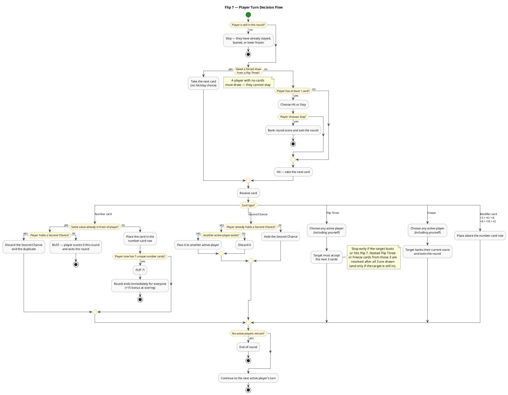
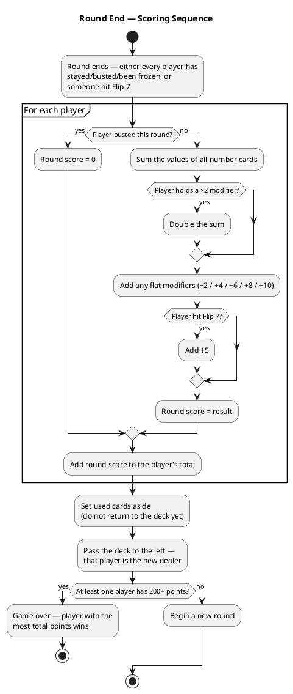

# Flip 7 — Complete Game Rules

## Overview

Flip 7 is a press-your-luck card game where players race to accumulate points across multiple rounds. The player who first reaches **200 points** (or more) at the end of any round wins. If multiple players cross 200 in the same round, the player with the **most total points** wins.

| Property | Value |
|---|---|
| Players | 3+ (use two decks for 18+) |
| Age | 8+ |
| Duration | ~20 minutes |
| Goal | First to 200+ points |

---

## Deck Composition (94 cards total)

### Number Cards — 79 cards

Each number card's **count in the deck equals its face value**, except 0 which has 1 copy.

| Value | Count | Bustable |
|---|---|---|
| 0 | 1 | Yes |
| 1 | 1 | Yes |
| 2 | 2 | Yes |
| 3 | 3 | Yes |
| 4 | 4 | Yes |
| 5 | 5 | Yes |
| 6 | 6 | Yes |
| 7 | 7 | Yes |
| 8 | 8 | Yes |
| 9 | 9 | Yes |
| 10 | 10 | Yes |
| 11 | 11 | Yes |
| 12 | 12 | Yes |

> **Design note:** The deck is weighted toward higher numbers. There are 12× more 12s than 1s, skewing average value — and bust risk for high cards is lower.

### Action Cards — 9 cards

| Card | Count | Effect |
|---|---|---|
| Flip Three | 3 | Target any active player (including yourself) — they must accept the next 3 cards |
| Freeze | 3 | Target any active player (including yourself) — they immediately bank and exit the round |
| Second Chance | 3 | Protects the holder against one duplicate number card |

### Score Modifier Cards — 6 cards

| Card | Count | Effect |
|---|---|---|
| +2 | 1 | Add 2 to number card total |
| +4 | 1 | Add 4 to number card total |
| +6 | 1 | Add 6 to number card total |
| +8 | 1 | Add 8 to number card total |
| +10 | 1 | Add 10 to number card total |
| x2 | 1 | Double your number card total (applied before flat modifiers) |

> **Note:** Modifier cards and Action cards are **never bustable**. Only Number cards cause busts.

---

## Setup

1. Shuffle the full 94-card deck.
2. Choose a dealer for the first round.
3. Have a scoresheet ready.

---

## Gameplay

### Starting a Round

1. The dealer deals one card face-up to each player (including themselves), starting with the player to the dealer's left and ending with themselves.
2. If an **Action card** is dealt, pause and resolve it immediately before continuing.
3. If a player is frozen during the opening deal (e.g. by a Freeze card resolved earlier in the deal), they are **skipped** and do not receive an opening card.
4. The opening deal ends once each remaining active player has been dealt exactly one card, even if that card was an Action card that does not remain in front of them.

> After initial dealing, players may have different numbers of cards due to Action cards. Some players may even start their first turn with no cards in front of them.

### Turn Structure

Each active player in turn order, starting with the player to the dealer's left, chooses:

| Choice | Condition | Effect |
|---|---|---|
| **Hit** | Always available if active | Receive the next card from the deck |
| **Stay** | Must hold at least 1 card | Bank current points, exit round (inactive) |

When cards are received, arrange them:
- **Number cards** — in a single face-up row
- **Modifier cards** — above the number card row
- **Action cards** — above the number card row (resolved immediately)

### Active vs. Inactive Players

| State | How entered | Visual indicator |
|---|---|---|
| Active | Start of round | Cards face-up |
| Inactive (stayed) | Chose to Stay or was Frozen | Cards face-down |
| Inactive (busted) | Received a duplicate number | Cards face-down, scores 0 |
| Inactive (Flip 7) | Collected 7 unique numbers | Cards face-down, round ends |

---

## Card Type Details

### Number Cards

- Placed in the player's face-up row.
- If the player already holds a card of the **same value**, they **bust** (unless they hold a Second Chance).
- If collecting a number card brings the player's unique number count to **7**, they achieve **Flip 7** and the round ends immediately.

### Flip Three

1. The player who received the card targets **any active player**, including themselves.
2. The targeted player must accept the **next 3 cards** from the deck, one at a time.
3. Stop early if the target busts or achieves Flip 7 before all 3 are drawn.
4. If a **Second Chance** appears in those 3 cards, the target sets it aside to use.
5. If another **Flip Three** or **Freeze** appears in those 3 cards, resolve it **after** all 3 cards are drawn (unless the target has already busted).

### Freeze

1. The player who received the card targets **any active player**, including themselves.
2. The targeted player immediately banks their current points and exits the round.
3. The Freeze card does not affect the targeted player's score — they simply bank whatever they had.

### Second Chance

- Held face-up in front of the player.
- When the player receives a **duplicate number card**, discard both the Second Chance and the duplicate — the bust is negated.
- Only **one Second Chance** per player at a time. If dealt a second one, give it to another active player (or discard if none are available).
- Discarded at the end of the round even if unused.

### Modifier Cards (+2, +4, +6, +8, +10, x2)

- Placed above the number card row.
- Do not cause busts.
- Do not count toward the Flip 7 target.
- The **x2** card is only useful if the player holds at least one number card.

---

## Busting

A player **busts** (scores 0 for the round) when they receive a number card with the same value as one already in their row.

- Busting is only possible with **number cards** (bustable = True).
- Modifier and Action cards **never** cause a bust.
- A **Second Chance** card negates one bust.

---

## Flip 7 Bonus

If a player accumulates **7 unique number cards** (0–12, all different values):

- The **round ends immediately** for all players.
- That player earns a **+15 point bonus** on top of their normal score.
- Only the 13 number card types count; Modifier and Action cards are ignored.

---

## Scoring

Calculate scores in this exact order:

1. **Sum** all number card values.
2. If holding a **x2** modifier, **double** the sum from step 1.
3. **Add** flat modifier values (+2/+4/+6/+8/+10).
4. If the player achieved Flip 7, **add 15**.

| Condition | Score |
|---|---|
| Busted | 0 (regardless of cards held) |
| Stayed / Frozen | Apply steps 1–4 above |
| Flip 7 | Apply steps 1–4, then +15 |

> **Edge cases:**
> - You **can** score with only Modifier cards and no number cards (flat modifiers still add up).
> - A **x2** modifier with no number cards scores 0 from the multiply step, but flat modifiers still apply.

### Scoring Example

```
Number cards:  11 + 5 + 12  = 28
x2 modifier:   28 × 2       = 56
+4 modifier:   56 + 4       = 60 pts
```

---

## Between Rounds

1. **Set used cards aside** — do not return them to the deck yet.
2. **Pass the remaining deck** to the left; that player is the new dealer.
3. Immediately after the **last card is drawn** from the draw pile, shuffle all set-aside cards into a new deck.
4. If reshuffling happens **mid-round**, cards in front of players are left as-is — only the set-aside pile is reshuffled.

---

## Winning

- Track cumulative scores across rounds.
- At the end of any round in which at least one player reaches **200+ points**, the game ends.
- The player with the **most total points** wins.

---

## Strategy Tips

- The deck is weighted toward higher numbers (12× more 12s than 1s), which raises both expected value and bust risk for high cards.
- Zero cards are worth no points but still count toward the Flip 7 bonus, making them valuable filler.
- Tracking which numbers have already been played is the simplest way to assess bust risk on your next hit.
- Modifier cards never bust and never count toward Flip 7 — they're pure upside.

---

## Player Decision Flow

The diagram below covers every branch a player must handle on their turn.



---

## Round-End Scoring Flow


